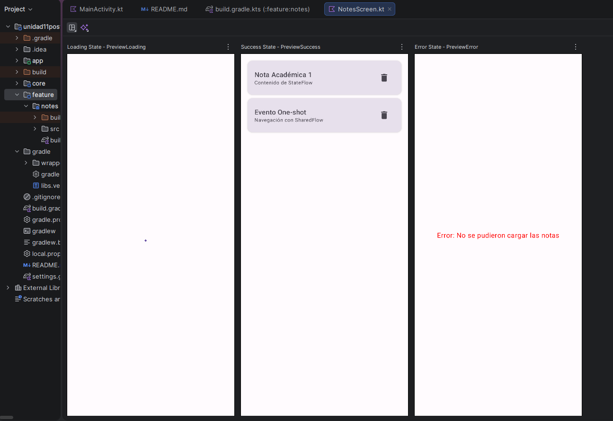

# Rizo_Arias-post1-u11

# PostContenido 1 — Arquitectura Reactiva con Módulo Feature

Aplicaciones Móviles – Unidad 11  
Ingeniería de Sistemas – 2026

---

# Descripción del Proyecto

Este proyecto implementa una aplicación Android multi-módulo basada en principios de arquitectura limpia y reactiva. Se desarrolló un módulo independiente llamado `feature:notes`, encargado de administrar la funcionalidad de notas.

La aplicación utiliza:

- Kotlin
- Jetpack Compose
- Hilt
- Coroutines
- StateFlow
- SharedFlow
- Navigation Compose
- Arquitectura multi-módulo

El objetivo principal es desacoplar responsabilidades y garantizar comunicación entre módulos mediante contratos definidos en la capa de dominio.

---

# Objetivo

Implementar un módulo feature independiente utilizando:

✅ StateFlow para gestión de estado  
✅ SharedFlow para eventos one-shot  
✅ Hilt para inyección de dependencias  
✅ Arquitectura reactiva  
✅ Persistencia del estado al rotar pantalla  

---

# Estructura del Proyecto

```text
app/

core/
├── domain/
├── data/
├── ui/

feature/
└── notes/
```

### :app

Módulo principal encargado de iniciar la aplicación.

### :core:domain

Contiene:

- modelos
- contratos
- interfaces
- reglas de negocio

### :core:ui

Contiene componentes reutilizables.

### :feature:notes

Módulo independiente encargado de:

- mostrar notas
- crear notas
- eliminar notas
- navegación

---

# Arquitectura

Se implementó Clean Architecture combinada con MVVM.

```text
UI (Compose)
      ↓
ViewModel
      ↓
Repository
      ↓
Domain
      ↓
Data
```

La interfaz nunca accede directamente a las fuentes de datos.

---

# Gestión Reactiva

## StateFlow

Se utilizó StateFlow para representar estados persistentes:

- Loading
- Success
- Error

Ventajas:

- mantiene último valor
- sobrevive rotaciones
- integración nativa Compose
- actualizaciones reactivas

Ejemplo:

```kotlin
private val _uiState =
MutableStateFlow<NotesUiState>(
    NotesUiState.Loading
)
```

---

## SharedFlow

Se utilizó SharedFlow para eventos temporales:

- navegación
- mensajes
- acciones one-shot

Ejemplo:

```kotlin
private val _events =
MutableSharedFlow<NotesEvent>()
```

Evita repetir eventos después de rotaciones.

---

# Estados Implementados

La aplicación posee tres estados:

## Loading

Muestra indicador de carga.

Captura:

```text
/screenshots/loading.png
```

---

## Success

Muestra lista de notas.

Captura:

```text
/screenshots/success.png
```

---

## Error

Muestra mensaje de error.

Captura:

```text
/screenshots/error.png
```

---

# Navegación

Flujo:

```text
Lista Notas
      ↓
Click Nota
      ↓
SharedFlow emite evento
      ↓
NavigateToDetail
      ↓
Pantalla detalle
```

---

# Dependencias Utilizadas

- Hilt
- Kotlin Coroutines
- Compose BOM
- Lifecycle Compose
- ViewModel
- Material3
- Navigation Compose

---

# Decisiones de Diseño

Se decidió utilizar arquitectura multi-módulo porque:

- reduce acoplamiento
- facilita mantenimiento
- permite escalabilidad
- mejora organización

StateFlow fue elegido porque conserva estado tras rotación.

SharedFlow se utilizó para eventos temporales evitando duplicaciones.

---

# Checkpoints Verificados

✅ módulo feature compila correctamente

✅ ViewModel funcional

✅ StateFlow conserva estado

✅ SharedFlow no repite eventos

✅ navegación correcta

✅ rotación verificada

---

# Cómo ejecutar

1. Clonar repositorio:

```bash
git clone URL_DEL_REPOSITORIO
```

2. Abrir Android Studio

3. Esperar sincronización Gradle

4. Ejecutar aplicación

---

## Evidencias del Proyecto

Las evidencias del desarrollo se encuentran organizadas en la carpeta:

```text
/evidencias/
```

Estas capturas se dividen según cada actividad del módulo CI/CD.

---

# Evidencias 

---

## Loading, Success y Error



---

## Loading, Success y Error


---

## Loading, Success y Error


